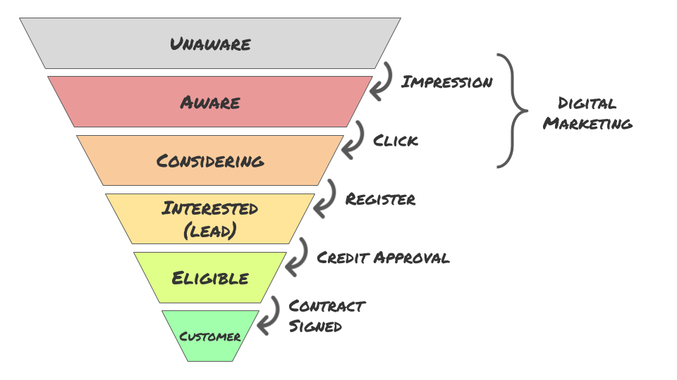

### A little bit on digital marketing

Digital Marketing is all about attracting new customers using online tools, such as facebook, google search, LinkedIn, and others. All these platforms provide paid capabilities for companies willing to advertise their products to potential customers. In short, digital marketing is just like traditional marketing but using digital media instead of physical ones (like newspaper, magazines, outdoors). Also, a key difference between them is that with digital media is possible to track user engagement and adjust the marketing strategy accordingly, optimizing the money spent with marketing.

Here are some of the key digital marketing concepts:

 - *Campaign*: a marketing campaign is a series of coordinated advertising actions intended to target a specific group of potential customers;
 - *Ad Creative*: a graphical image or video that conveys the message being advertised;
 - *Ad Impressions*: one single occurrence of displaying an ad to a potential customer;
 - *Clicks*: one single click on the ad that leads the customer to the company's website;
 
### Creditas conversion funnel

We can look at the path the customers goes from getting to know our company to converting into a customer as a multi-step process funnel. It is a funnel because for each further step we look, we will progressively find less people involved. The following image illustrates a very simplified version of the conversion funnel we have here at Creditas.

Initially the customer is unaware of our product, the goal of digital marketing is attract potential customers into the conversion funnel. After the customer fills out a lead form (that means he/she is interested), we will run the credit analysis and then formalize the operation signing the contract.

The operation may not be completed by many reasons, such as:
- the customer is not approved in credit analysis;
- the customer is suspected of being a fraud;
- the customer loses interest and quits the process.
